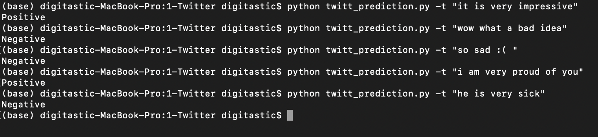
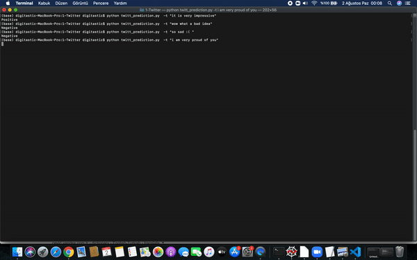

# Twitter Sentiment Analysis

For training

```
  python twitt_training.py -p your_csv_path
```
For testing

```
  python twitt_prediction.py -t "your_sample_text"
```
<<<<<<< HEAD

=======




>>>>>>> 9a94383e4808857af75702f76fef1050de699fe4
* If you want to retrain according to your own twitter data set, columns called "twitts" and "sentiment" should be used..
* *(optional)* If you want to do hyperparameter tuning;
```
  python twitt_training.py -p your_csv_path -t True
```


